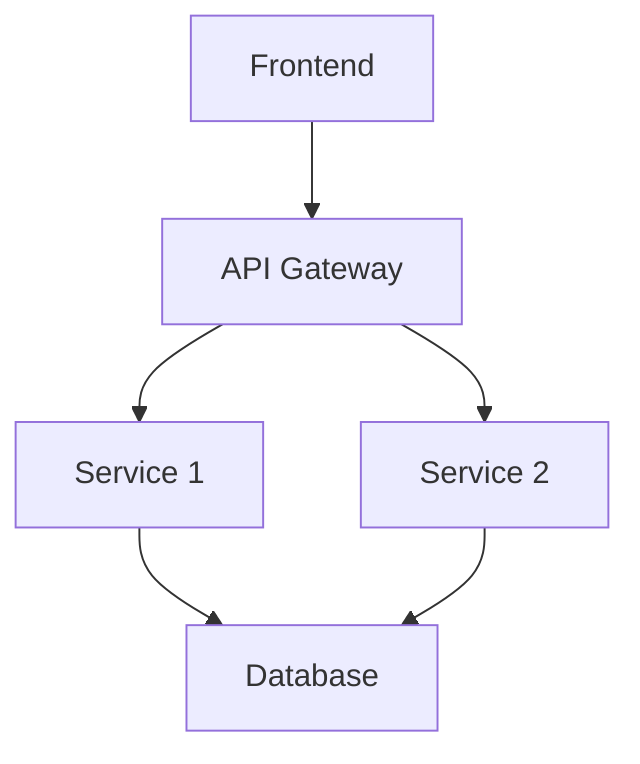

# Developer Documentation Repository Specification
**Version**: 1.0.0  
**Last Updated**: 2025-01-02  
**Status**: Active Specification

## 🎯 Purpose

This document defines the comprehensive specification for `[projectName]-docs` repositories, establishing standards for structure, content quality, and maintenance practices optimized for AI-assisted development with tools like Claude Code.

## 📋 Core Principles

### 1. AI-First Documentation Design
- **Machine-Readable Navigation**: Every docs repository MUST include a `.docindex.json` file for AI tool discovery
- **Consistent Metadata**: All documents MUST include standardized frontmatter (date, status, category)
- **Cross-Reference Rich**: Documents MUST extensively link to related content
- **Progressive Disclosure**: Information MUST flow from overview → details → examples → edge cases

### 2. Single Source of Truth
- One canonical location for each piece of information
- No duplicate documentation across repositories
- Clear deprecation patterns for outdated content
- Version-controlled history for all changes

### 3. Living Documentation
- Documentation MUST evolve with the codebase
- Regular audits and updates required
- Automated validation where possible
- Community contribution friendly

## 🏗️ Repository Structure

### Required Directory Hierarchy

```
[projectName]-docs/
├── .docindex.json           # Machine-readable index (REQUIRED)
├── README.md                # Main navigation and overview (REQUIRED)
├── VERSION_COMPATIBILITY.md # Version tracking matrix (REQUIRED)
├── architecture/            # System design documentation
│   ├── README.md           # Architecture overview and navigation
│   ├── overview.md         # High-level system architecture
│   ├── stack.md           # Technology stack with versions
│   ├── data-flow.md       # Data flow diagrams and descriptions
│   └── decisions/         # Architecture Decision Records (ADRs)
├── development/            # Development guides by platform/component
│   ├── README.md          # Development overview
│   ├── quick-start.md     # Getting started guide
│   ├── [component].md     # Component-specific guides
│   └── patterns.md        # Common patterns and practices
├── api/                   # API documentation
│   ├── README.md          # API overview
│   ├── rest.md           # REST API reference
│   ├── graphql.md        # GraphQL schema (if applicable)
│   ├── websocket.md      # WebSocket events (if applicable)
│   ├── authentication.md  # Auth patterns and examples
│   └── errors.md         # Error codes and handling
├── deployment/           # Deployment and infrastructure
│   ├── README.md         # Deployment overview
│   ├── environment.md    # Environment variables reference
│   ├── [platform].md     # Platform-specific guides (vercel.md, aws.md, etc.)
│   ├── database.md       # Database setup and migrations
│   └── monitoring.md     # Observability configuration
├── operations/          # Production operations
│   ├── README.md        # Operations overview
│   ├── maintenance.md   # Regular maintenance tasks
│   ├── troubleshooting.md # Common issues and solutions
│   ├── performance.md   # Performance optimization
│   ├── security.md      # Security best practices
│   └── runbooks/        # Incident response procedures
├── reference/          # Technical specifications
│   ├── README.md       # Reference overview
│   ├── database-schema.md # Complete schema reference
│   ├── configuration.md   # All configuration options
│   ├── api-errors.md     # Error code reference
│   └── glossary.md       # Term definitions
├── resources/         # Additional resources
│   ├── README.md      # Resources overview
│   ├── roadmap.md     # Product roadmap
│   ├── changelog.md   # Version history
│   └── contributing.md # Contribution guidelines
└── archive/          # Historical documentation
    ├── README.md     # Archive overview and policy
    ├── implementation-history/
    ├── design-decisions/
    ├── feature-docs/
    └── legacy-code/
```

### Required Files

#### `.docindex.json` Specification

```json
{
  "version": "1.0.0",
  "lastUpdated": "YYYY-MM-DD",
  "description": "Machine-readable index for [projectName] documentation",
  "categories": {
    "getting-started": {
      "description": "Quick start guides and overviews",
      "docs": ["README.md", "architecture/overview.md", "development/quick-start.md"]
    },
    "authentication": {
      "description": "Authentication and authorization",
      "docs": ["api/authentication.md", "reference/configuration.md#auth"]
    },
    // ... additional categories
  },
  "keywords": {
    "database": ["reference/database-schema.md", "deployment/database.md"],
    "api": ["api/*.md", "reference/api-errors.md"],
    // ... additional keywords
  },
  "common-tasks": {
    "setup-dev-environment": "development/quick-start.md",
    "deploy-to-production": "deployment/README.md",
    "debug-api-errors": "operations/troubleshooting.md#api",
    // ... additional tasks
  },
  "dependencies": {
    "codebase": "[projectName]",
    "version": ">=1.0.0",
    "related-repos": ["[projectName]", "[projectName]-api", "[projectName]-mobile"]
  }
}
```

## 📝 Document Standards

### Universal Document Template

```markdown
# Document Title

**Last Updated**: YYYY-MM-DD  
**Status**: Current|Deprecated|Planned|Draft  
**Category**: Guide|Reference|API|Architecture  
**Related**: [Link to related doc], [Another related doc]

## Overview

Brief description of the document's purpose and what readers will learn. Should be 2-3 sentences maximum.

## Table of Contents

- [Prerequisites](#prerequisites)
- [Main Content Section 1](#main-content-section-1)
- [Main Content Section 2](#main-content-section-2)
- [Examples](#examples)
- [Troubleshooting](#troubleshooting)
- [See Also](#see-also)

## Prerequisites

- Required knowledge or setup
- Links to prerequisite documentation
- Version requirements

## Main Content Section 1

### Subsection

Content with:
- Clear explanations
- Step-by-step instructions where applicable
- Code examples in appropriate language

```language
// Code example with comments
const example = "Always include working examples";
```

### Important Notes

> **Note**: Callouts for important information use blockquotes

> **Warning**: Critical warnings that could cause issues

> **Tip**: Helpful tips for better results

## Examples

### Basic Example

```language
// Complete, runnable example
// Include all necessary imports
```

### Advanced Example

```language
// More complex scenario
// Show best practices
```

## Troubleshooting

### Common Issue 1

**Symptoms**: Description of what goes wrong

**Cause**: Why it happens

**Solution**:
1. Step-by-step fix
2. With clear instructions

### Common Issue 2

[Same format]

## See Also

- [Related Document 1](../path/to/doc.md) - Brief description
- [External Resource](https://example.com) - Why it's relevant
- [API Reference](../api/reference.md#specific-section) - For detailed specs
```

### Content Quality Standards

#### 1. Clarity and Conciseness
- Use simple, direct language
- Avoid jargon without explanation
- One concept per paragraph
- Active voice preferred

#### 2. Completeness
- Cover common use cases
- Include edge cases and limitations
- Provide working examples
- Link to deeper resources

#### 3. Accuracy
- Test all code examples
- Verify version compatibility
- Update dates when modified
- Flag planned features clearly

#### 4. Visual Aids
- Use diagrams for complex flows
- Include screenshots for UI elements
- Provide architecture diagrams
- Add tables for comparison data

#### 5. Code Examples
- Must be complete and runnable
- Include all imports/dependencies
- Add meaningful comments
- Show both basic and advanced usage
- Include error handling

## 🔧 Maintenance Practices

### Regular Audits

#### Weekly Reviews
- Check for broken links
- Verify code examples still work
- Update version numbers
- Archive outdated content

#### Monthly Audits
- Full content accuracy review
- Cross-reference validation
- Performance metrics review
- User feedback incorporation

#### Quarterly Updates
- Major version compatibility checks
- Architecture diagram updates
- Comprehensive rewrite of changed features
- Archive migration for deprecated content

### Version Control Practices

1. **Commit Messages**
   ```
   docs: [scope] brief description
   
   - Detailed change 1
   - Detailed change 2
   
   Refs: #issue-number
   ```

2. **Branch Strategy**
   - `main`: Current stable documentation
   - `develop`: Upcoming features documentation
   - `archive/[version]`: Historical snapshots

3. **Review Process**
   - All changes require review
   - Technical accuracy verification
   - Grammar and clarity check
   - Link validation

### Automated Validation

Required CI/CD checks:
- Link checking (internal and external)
- Markdown linting
- Code example validation
- Version compatibility verification
- Search index generation

## 🤖 AI Tool Optimization

### Claude Code Integration

1. **CLAUDE.md Enhancement**
   ```markdown
   # [ProjectName] Documentation Guide
   
   - Documentation lives in [projectName]-docs repository
   - Use @docs tag to reference documentation
   - Key directories: architecture/, api/, reference/
   - Always check VERSION_COMPATIBILITY.md for versions
   ```

2. **Navigation Patterns**
   - Use .docindex.json for quick discovery
   - Reference specific sections with anchors
   - Maintain consistent file naming (kebab-case)
   - Group related content in subdirectories

3. **Context Building**
   - Start with architecture/overview.md
   - Reference specific guides for tasks
   - Use archive/ for historical context
   - Link extensively between documents

### Search Optimization

1. **Keyword Density**
   - Primary keywords in headings
   - Natural keyword distribution
   - Synonyms and related terms
   - Technical terms in glossary

2. **Metadata Rich**
   - Descriptive file names
   - Clear section headings
   - Comprehensive frontmatter
   - Tagged categories

## 📊 Quality Metrics

### Documentation Health Score

Calculate monthly:
```
Health Score = (Completeness + Accuracy + Freshness + Usability) / 4

Where:
- Completeness = % of features documented / total features
- Accuracy = % of validated examples / total examples  
- Freshness = % of docs updated in last 90 days
- Usability = average time to find information (from analytics)
```

### Target Metrics
- **Coverage**: 95%+ of public APIs documented
- **Accuracy**: 100% of examples tested and working
- **Freshness**: 80%+ updated within 90 days
- **Response Time**: <2 seconds to find any document
- **Cross-References**: Average 3+ links per document

## 🚀 Implementation Checklist

### Initial Setup
- [ ] Create repository with standard structure
- [ ] Initialize .docindex.json with all categories
- [ ] Write comprehensive README.md
- [ ] Set up VERSION_COMPATIBILITY.md
- [ ] Create navigation README in each directory
- [ ] Configure CI/CD for validation
- [ ] Set up automated link checking
- [ ] Create initial architecture documentation

### Migration from Existing Docs
- [ ] Audit current documentation
- [ ] Map to new structure
- [ ] Rewrite to match templates
- [ ] Validate all code examples
- [ ] Update cross-references
- [ ] Archive outdated content
- [ ] Update .docindex.json
- [ ] Test with AI tools

### Ongoing Maintenance
- [ ] Weekly link validation
- [ ] Monthly content audit
- [ ] Quarterly major updates
- [ ] Annual structure review
- [ ] Continuous user feedback
- [ ] Regular metric tracking
- [ ] Team training updates
- [ ] Tool compatibility checks

## 🔗 Integration Points

### With Development Workflow
1. **Pre-commit Hooks**
   - Validate documentation changes
   - Update last modified dates
   - Check for broken links

2. **PR Templates**
   - Documentation update checklist
   - Required sections for new features
   - Review criteria

3. **Release Process**
   - Documentation sign-off required
   - Changelog generation
   - Version compatibility updates

### With AI Development Tools
1. **Claude Code**
   - Reference via @docs shortcuts
   - Include in CLAUDE.md instructions
   - Optimize for extended thinking

2. **GitHub Copilot**
   - Inline documentation references
   - Example-driven development
   - Pattern recognition

3. **Custom Tooling**
   - Documentation API endpoints
   - Search integration
   - Analytics tracking

## 📚 Best Practices Summary

### Do's
- ✅ Write for both humans and AI
- ✅ Include working examples
- ✅ Cross-reference extensively
- ✅ Keep content current
- ✅ Use consistent formatting
- ✅ Test everything
- ✅ Archive don't delete
- ✅ Version track changes

### Don'ts
- ❌ Duplicate information
- ❌ Use ambiguous language
- ❌ Skip prerequisites
- ❌ Ignore user feedback
- ❌ Break existing links
- ❌ Mix concerns in one doc
- ❌ Assume prior knowledge
- ❌ Use outdated examples

## 🎓 Training and Onboarding

### For Documentation Writers
1. Review this specification completely
2. Study existing high-quality examples
3. Practice with template documents
4. Get feedback on first contributions
5. Learn the tooling and automation

### For Developers
1. Understand documentation-first development
2. Learn to write while coding
3. Use documentation as specification
4. Contribute improvements
5. Report issues and gaps

### For AI Tool Users
1. Learn .docindex.json structure
2. Practice navigation patterns
3. Understand linking conventions
4. Use appropriate detail levels
5. Contribute AI-specific improvements

---

## Appendix A: Example Documents

### Example Architecture Overview

```markdown
# System Architecture

**Last Updated**: 2025-01-02  
**Status**: Current  
**Category**: Architecture  
**Related**: [Technology Stack](./stack.md), [Data Flow](./data-flow.md)

## Overview

[ProjectName] is a [brief description] built with [key technologies]. This document provides a high-level view of the system architecture and component relationships.

## System Components

### Frontend Application
- **Technology**: [Framework] [Version]
- **Responsibility**: User interface and experience
- **Key Features**: [List main features]

### Backend Services
- **Technology**: [Framework] [Version]
- **Responsibility**: Business logic and data processing
- **Key Features**: [List main features]

### Data Layer
- **Technology**: [Database] [Version]
- **Responsibility**: Data persistence and retrieval
- **Key Features**: [List main features]

## Architecture Diagram



[Continue with standard sections...]
```

### Example API Reference

```markdown
# REST API Reference

**Last Updated**: 2025-01-02  
**Status**: Current  
**Category**: API  
**Related**: [Authentication](./authentication.md), [Error Handling](./errors.md)

## Overview

The [ProjectName] REST API provides programmatic access to all platform features. This reference covers all available endpoints, request/response formats, and usage examples.

## Base URL

```
Production: https://api.projectname.com/v1
Development: http://localhost:3000/api/v1
```

## Authentication

All requests require authentication. See [Authentication Guide](./authentication.md).

```bash
curl -H "Authorization: Bearer YOUR_TOKEN" https://api.projectname.com/v1/resource
```

## Endpoints

### Users

#### Get Current User

```http
GET /users/me
```

**Response**
```json
{
  "id": "user_123",
  "email": "user@example.com",
  "name": "John Doe",
  "createdAt": "2025-01-02T00:00:00Z"
}
```

[Continue with all endpoints...]
```

---

*This specification is version 1.0.0 and should be reviewed quarterly for updates and improvements.*