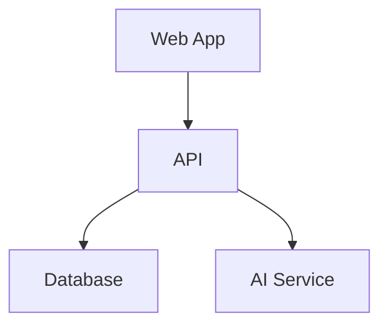

# Visual Documentation Hub

This directory contains all visual diagrams and architectural visualizations for the developer ecosystem. All diagrams are created and maintained using the `/user:diagram` Claude Code command.

## Directory Structure

```
diagrams/
├── architecture/          # System architecture diagrams
│   ├── high-level/       # Overview and system-wide diagrams
│   ├── data-flow/        # Data flow and sequence diagrams
│   └── component/        # Component-level architecture
├── workflows/            # Process and workflow visualizations
│   ├── development/      # Development process flows
│   └── operations/       # Operational procedures
├── concepts/             # Conceptual and abstract diagrams
│   ├── patterns/         # Design pattern visualizations
│   └── mental-models/    # Abstract concept diagrams
├── reference/            # Quick reference visuals
│   ├── cheatsheets/      # Visual cheatsheets
│   └── comparisons/      # Comparison charts and matrices
├── tools/                # Tool-specific diagrams
└── assets/               # Shared visual assets
    ├── icons/            # Reusable icons and symbols
    ├── templates/        # Diagram templates
    └── styles/           # Style guides and themes
```

## Diagram Types

### 1. Architecture Diagrams
- **System Overview**: High-level architecture showing all components
- **Service Communication**: How services interact
- **Deployment Architecture**: Infrastructure and deployment topology
- **Package Dependencies**: Module and package relationships

### 2. Data Flow Diagrams
- **Sequence Diagrams**: Step-by-step process flows
- **State Machines**: Application state transitions
- **Data Pipelines**: ETL and data transformation flows
- **API Flows**: Request/response sequences

### 3. Entity Relationships
- **Database Schemas**: Table relationships and structure
- **Domain Models**: Business entity relationships
- **Object Models**: Class and interface hierarchies

### 4. UI/UX Diagrams
- **Component Hierarchies**: UI component trees
- **Navigation Flows**: User journey maps
- **Interaction Patterns**: User interaction sequences
- **Screen Flows**: Application navigation

### 5. Conceptual Diagrams
- **Mental Models**: Abstract concept visualization
- **Design Patterns**: Pattern implementation guides
- **Architecture Patterns**: System design patterns
- **Process Models**: Business process visualization

## Creating Diagrams

Use the `/user:diagram` command in Claude Code:

```bash
# Create a new architecture diagram
/user:diagram architecture for webs

# Visualize data flow
/user:diagram show user authentication flow

# Generate from existing code
/user:diagram analyze packages/api and create component diagram

# Update existing diagram
/user:diagram update webs-architecture with new ai service
```

## Diagram Formats

### Primary Format: Mermaid
All diagrams are created in Mermaid format for:
- Easy version control
- Inline markdown rendering
- GitHub/GitLab support
- AI-friendly parsing

Example:


### Export Formats
- **SVG**: Vector graphics for documentation
- **PNG**: Raster images for presentations
- **PDF**: Print-ready documentation

## Style Guidelines

### 1. Consistency
- Use project-specific color schemes
- Maintain consistent node shapes
- Follow established patterns

### 2. Clarity
- Clear, descriptive labels
- Logical flow direction
- Appropriate detail level

### 3. Accessibility
- High contrast colors
- Clear typography
- Alternative text descriptions

## Integration with Projects

Each project's documentation (`[projectName]-docs/`) should reference these diagrams:

```markdown
# In project documentation


# Or embed directly
![[diagrams/workflows/development/feature-flow.md]]
```

## Maintenance

### Updating Diagrams
1. Use `/user:diagram update [diagram-name]`
2. Diagrams auto-version with timestamps
3. Changes tracked in session history

### Review Schedule
- Architecture diagrams: Update with major changes
- Workflow diagrams: Review quarterly
- Reference diagrams: Update as needed

## Best Practices

1. **Start Simple**: Begin with high-level overviews
2. **Progressive Detail**: Add detail in separate diagrams
3. **Context Matters**: Include relevant context in diagrams
4. **Living Documents**: Update as systems evolve
5. **Cross-Reference**: Link between related diagrams

## Tools and Resources

### Recommended Tools
- **Mermaid Live Editor**: https://mermaid.live
- **draw.io**: For complex diagrams
- **Excalidraw**: For hand-drawn style

### Templates
Find reusable templates in `assets/templates/`:
- `architecture-template.mermaid`
- `sequence-template.mermaid`
- `flowchart-template.mermaid`

## Contributing

When adding new diagrams:
1. Follow the directory structure
2. Use descriptive filenames
3. Include diagram metadata
4. Update relevant documentation
5. Add to `.docindex.json` for AI discovery

---

*Generated and maintained via `/user:diagram` command*