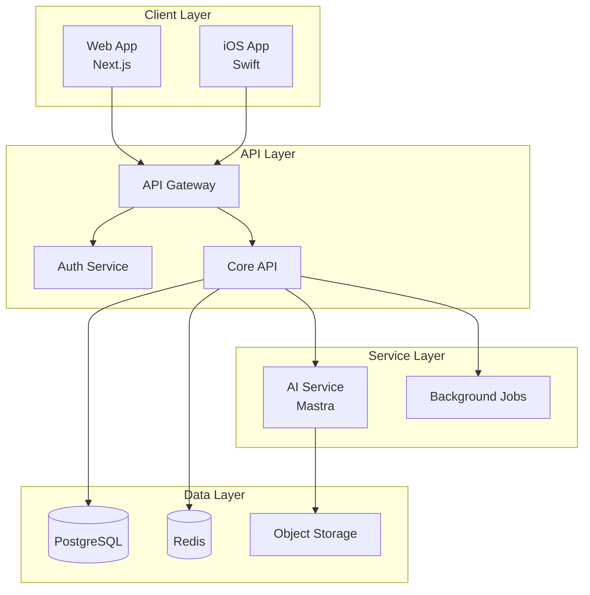

# Architecture Diagrams

System and application architecture visualizations that show the structure, components, and relationships within projects.

## Categories

### high-level/
System-wide architecture diagrams showing:
- Overall system architecture
- Service boundaries
- External integrations
- Technology stack overview

### data-flow/
Data movement and transformation diagrams showing:
- API request/response flows
- Event-driven architectures
- Data pipelines
- Message queue flows

### component/
Detailed component architecture showing:
- Internal module structure
- Package dependencies
- Class hierarchies
- Interface relationships

## Naming Convention

`[project]-[scope]-[type]-[version].md`

Examples:
- `webs-system-overview-v1.md`
- `arbor-data-flow-auth.md`
- `shared-component-hierarchy.md`

## Example: System Overview



## Creating Architecture Diagrams

```bash
# Create System Overview
/user:diagram architecture overview for [project]

# Create Data Flow
/user:diagram data flow for [feature] in [project]

# Create Component Diagram
/user:diagram component structure for [package]
```

## Best Practices

1. **Layer Separation**: Clearly show architectural layers
2. **Boundary Definition**: Mark service/module boundaries
3. **Direction Flow**: Use consistent arrow directions
4. **Technology Labels**: Include tech stack information
5. **Version Tracking**: Update version numbers with changes

## See Also

- [Overview](/architecture/overview)
- [Turborepo](/architecture/turborepo)
- [AI Sdk](/tools/stack/ai-sdk)
