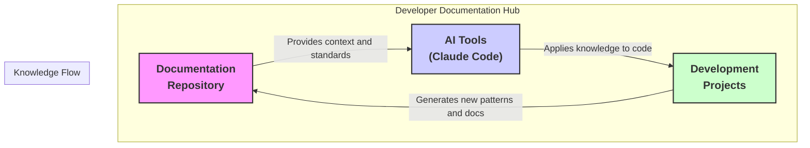

```mermaid
graph TD
    subgraph "Developer Documentation Hub"
        A["<div style='font-weight: bold; font-size: 1.2em;'>Documentation<br>Repository</div>"]
        B["<div style='font-weight: bold; font-size: 1.2em;'>AI Tools<br>(Claude Code)</div>"]
        C["<div style='font-weight: bold; font-size: 1.2em;'>Development<br>Projects</div>"]
    end

    subgraph "Knowledge Flow"
        A -- "Provides context and standards" --> B
        B -- "Applies knowledge to code" --> C
        C -- "Generates new patterns and docs" --> A
    end

    style A fill:#f9f,stroke:#333,stroke-width:2px
    style B fill:#ccf,stroke:#333,stroke-width:2px
    style C fill:#cfc,stroke:#333,stroke-width:2px
```
---
title: Developer Documentation Hub — Structure Overview
description: Analysis of documentation hub structure and organization strategy
---
