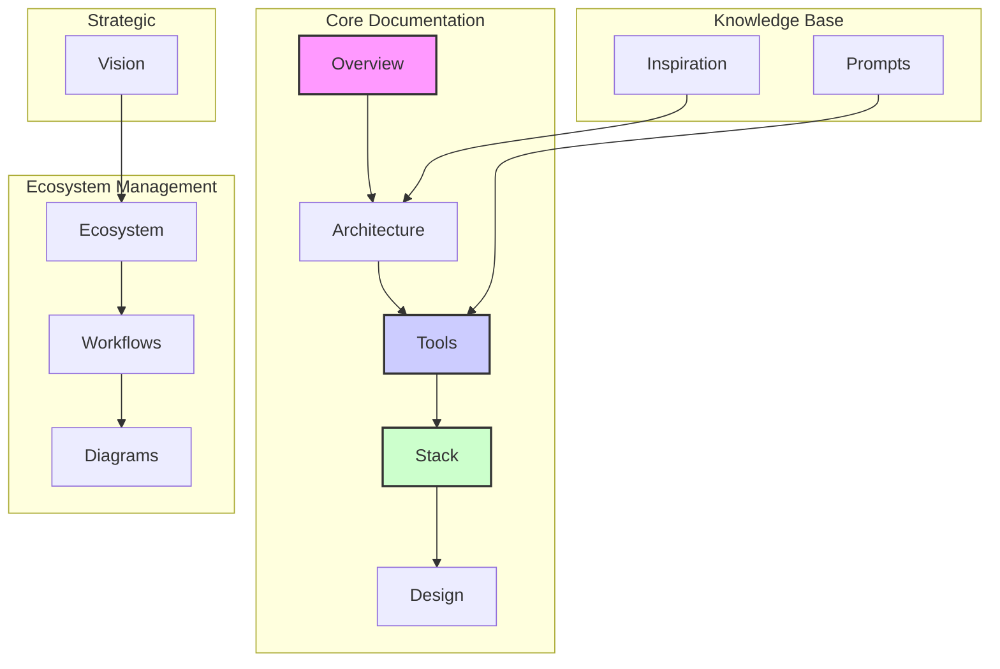

# Project Analysis: Developer Documentation Hub Structure and Organization Strategy

## Executive Summary

This document provides a comprehensive analysis of the Developer Documentation Hub's current structure, identifies gaps in documentation coverage, and proposes strategies for organizing the untracked directories discovered during recent system expansion. The analysis reveals a well-organized, AI-optimized documentation system with opportunities for enhancement in testing, CI/CD, and integration documentation.

## Analysis Overview

- **Analysis Date**: August 4, 2025
- **Repository**: Developer Documentation Hub (/Users/nit/Developer/docs)
- **Documentation System**: Mintlify Docs
- **Content Format**: MDX (Markdown with React components)
- **Total Sections**: 6 main tabs with nested navigation

## 1. Current Documentation Structure Analysis

### 1.1 High-Level Architecture

The documentation hub is organized into 6 primary tabs, each serving distinct purposes:

```
📄 Documentation
├── Overview → Project intro and setup
├── Architecture → Design patterns and standards
├── Tools → Development tool documentation
├── Stack → Technology-specific guides
└── Design → Design system resources

📝 Prompts
└── Available → Reusable AI prompt templates

💡 Inspiration
├── Design → Design philosophy references
├── Development → Modern dev practices
├── Architecture → Software architecture principles
└── Systems → Strategic thinking frameworks

🌐 Ecosystem
├── Overview → Project ecosystem info
├── Standards → Compliance and migration docs
└── Projects → Active project registry

🔄 Workflows
└── Commands → High-yield workflow documentation

📐 Diagrams
└── Architecture → Visual documentation

👁️ Vision
└── Quest Analysis → Project analysis documents
```

### 1.2 Content Distribution

- **Total MDX Files**: 100+
- **Primary Content Areas**: 6
- **Sub-categories**: 25+
- **Assets**: 200+ (fonts, images, icons)
- **Technology Stacks Documented**: 12+

### 1.3 Navigation Structure

The navigation follows a hierarchical structure with:
- **Tabs**: Horizontal primary navigation
- **Groups**: Logical content grouping within tabs
- **Pages**: Individual documentation topics
- **Global Anchors**: External links (GitHub, Mintlify Docs)

## 2. Untracked Directories Analysis

### 2.1 content/tools/integrations/

**Current Content**:
- `orpc-turborepo-guide.md`: Comprehensive oRPC integration guide for Turborepo projects

**Analysis**:
This document represents high-value technical content that should be integrated into the main documentation structure. It provides:
- Complete implementation patterns for oRPC + Turborepo
- Code examples and best practices
- Migration guides and troubleshooting
- CI/CD integration examples

**Recommended Integration**:
Create a new "Integrations" group under the Tools tab:
```
Tools → Integrations
├── oRPC with Turborepo
├── [future integration guides]
```

### 2.2 content/tools/stack/ai-sdk/

**Current Content**:
- `AI-PACKAGE-INSTRUCTIONS.md`: Complete standards for packages/ai implementation
- `ideal-packages-ai-structure.md`: Reference architecture for AI SDK v5 + Mastra

**Analysis**:
These documents contain critical implementation standards for AI integration across all projects. They represent:
- Production-ready patterns for AI SDK v5
- Mastra framework integration standards
- Type-safe implementations
- Comprehensive migration guides

**Recommended Integration**:
The AI SDK stack documentation should be merged with the existing stack documentation:
```
Tools → Stack → AI SDK (replace/update existing)
├── Overview → New consolidated overview
├── Package Structure → From ideal-packages-ai-structure.md
├── Implementation Standards → From AI-PACKAGE-INSTRUCTIONS.md
├── Migration Guide
└── Best Practices
```

## 3. Documentation Structure Map

### 3.1 Relationship Visualization



### 3.2 Cross-References

The documentation exhibits strong cross-referencing patterns:
- **Architecture → Tools**: Implementation guidance for architectural patterns
- **Stack → Architecture**: Technology-specific architectural considerations
- **Ecosystem → Stack**: Dependency management and version compatibility
- **Prompts → Tools**: AI-powered tool usage patterns

## 4. Missing Documentation Areas

### 4.1 Critical Gaps Identified

1. **Testing Framework & Practices**
   - No dedicated testing documentation
   - Missing unit, integration, and E2E testing guides
   - No test coverage strategies
   - Missing testing tool configurations (Jest, Vitest, Playwright)

2. **CI/CD Pipelines**
   - Limited GitHub Actions documentation
   - No deployment pipeline guides
   - Missing environment management strategies
   - No automated testing integration

3. **Development Environment Setup**
   - No local development setup guides
   - Missing Docker configuration documentation
   - No database setup and migration guides
   - Limited environment variable management

4. **Security Documentation**
   - No security best practices
   - Missing authentication implementation details
   - No API security guidelines
   - Missing data protection strategies

5. **Performance Optimization**
   - No performance monitoring guides
   - Missing optimization strategies
   - No caching implementation patterns
   - Limited scalability documentation

### 4.2 Secondary Gaps

1. **Error Handling Patterns**
2. **Logging and Monitoring**
3. **Internationalization (i18n)**
4. **Accessibility (a11y) Implementation**
5. **Mobile Development Patterns**
6. **Cloud Deployment Strategies**
7. **Cost Optimization**

## 5. Standardized Documentation Templates

### 5.1 Technology Stack Template

```markdown
# [Technology Name]

## Overview
Brief description of the technology, its purpose, and why it's used in the stack.

## Architecture
How this technology fits into the overall system architecture.

## Installation & Setup
```bash
# Installation commands
pnpm add [package-name]
```

## Configuration
Key configuration options and environment variables.

## Usage Patterns

### Basic Usage
```typescript
// Code example
```

### Advanced Patterns
```typescript
// Advanced implementation
```

## Integration Examples

### With [Other Technology]
```typescript
// Integration code
```

## Best Practices
1. Performance considerations
2. Security implications
3. Common pitfalls
4. Optimization strategies

## Troubleshooting
Common issues and solutions.

## Migration Guide
How to upgrade from previous versions.
```

### 5.2 Tool Documentation Template

```markdown
# [Tool Name]

## Purpose
What this tool does and the problem it solves.

## Features
- Feature 1
- Feature 2
- Feature 3

## Getting Started

### Prerequisites
- System requirements
- Dependencies

### Installation
```bash
# Install commands
```

### Configuration
```json
// config example
{
  "key": "value"
}
```

## Usage

### Basic Commands
```bash
# Common commands
tool --command
```

### Workflow Integration
How to integrate this tool into daily development workflow.

## Configuration Options
Detailed configuration documentation.

## Advanced Features
Power-user features and capabilities.

## Integration with Other Tools
How this tool works with others in the stack.

## Troubleshooting
Solutions to common problems.

## Contributing
How to contribute to the tool itself.
```

### 5.3 Architecture Template

```markdown
# [Architecture Pattern]

## Context
The problem this pattern solves and when to use it.

## Problem Statement
What issue this architectural pattern addresses.

## Solution
High-level overview of the solution.

## Structure
```
Directory Structure
├── How files are organized
└── Key components
```

## Implementation

### Step 1: Setup
Initial implementation steps.

### Step 2: Core Components
Building the main components.

### Step 3: Integration
How to integrate with existing systems.

## Example Code
```typescript
// Implementation example
```

## Benefits
- Advantage 1
- Advantage 2
- Advantage 3

## Considerations
- Trade-offs
- When not to use this pattern
- Alternative approaches

## Related Patterns
Similar or complementary architectural patterns.

## Real-World Examples
Examples from current projects using this pattern.
```

## 6. Organization Strategy for Untracked Content

### 6.1 Immediate Actions Required

1. **Integrate oRPC Documentation**
   - Move `content/tools/integrations/orpc-turborepo-guide.md`
   - Create new navigation structure under Tools → Integrations
   - Update docs.json navigation
   - Add cross-references from Turborepo stack docs

2. **Consolidate AI SDK Documentation**
   - Merge content from `content/tools/stack/ai-sdk/`
   - Update existing `content/tools/stack/ai-sdk.mdx`
   - Create hierarchical documentation structure
   - Ensure version consistency

### 6.2 Navigation Updates Required

Update `docs.json` with:

```json
{
  "tabs": [
    {
      "tab": "Documentation",
      "groups": [
        {
          "group": "Tools",
          "pages": [
            "tools/README",
            {
              "group": "Integrations",
              "pages": [
                "tools/integrations/orpc-turborepo"
              ]
            },
            // ... existing pages
          ]
        }
      ]
    }
  ]
}
```

### 6.3 Content Migration Strategy

1. **Phase 1: Integration**
   - Move untracked files into main content structure
   - Update internal links and references
   - Test navigation and rendering

2. **Phase 2: Enhancement**
   - Apply standardized templates
   - Add missing sections identified in gap analysis
   - Create cross-references

3. **Phase 3: Expansion**
   - Develop missing documentation for identified gaps
   - Prioritize based on developer needs
   - Create issue tracking for ongoing maintenance

## 7. Recommendations

### 7.1 High Priority (Immediate)

1. **Integrate Untracked Content**
   - Prevents documentation drift
   - Makes valuable content discoverable
   - Maintains documentation quality

2. **Add Testing Documentation**
   - Critical for development quality
   - Create shared testing patterns
   - Include CI/CD testing integration

3. **Create CI/CD Documentation**
   - Essential for deployment consistency
   - Document GitHub Actions patterns
   - Include environment management

### 7.2 Medium Priority (Next Quarter)

1. **Development Environment Setup**
   - Reduces onboarding friction
   - Standardizes local development
   - Include Docker and database setup

2. **Security Documentation**
   - Increasingly important for web applications
   - Document authentication patterns
   - Include API security best practices

### 7.3 Long Term (Next 6 Months)

1. **Performance Optimization Guide**
2. **Error Handling Standards**
3. **Logging and Monitoring Strategy**
4. **Internationalization Guide**
5. **Accessibility Implementation Guide**

## 8. Implementation Plan

### 8.1 Week 1: Integration
- [ ] Integrate oRPC documentation
- [ ] Update AI SDK stack documentation
- [ ] Test all navigation links
- [ ] Update docs.json

### 8.2 Week 2: Templates
- [ ] Apply standardized templates to integrated content
- [ ] Create template documentation for contributors
- [ ] Set up validation for new documentation

### 8.3 Week 3: Gap Filling
- [ ] Create testing documentation section
- [ ] Add CI/CD pipeline documentation
- [ ] Document development environment setup

### 8.4 Week 4: Review
- [ ] Full documentation audit
- [ ] User feedback collection
- [ ] Prioritize next documentation items

## 9. Success Metrics

- **Content Coverage**: Increase from 75% to 90% of critical topics documented
- **Integration Completion**: 100% of untracked content integrated
- **Template Adoption**: 80% of documentation follows standardized templates
- **User Satisfaction**: Positive feedback on documentation organization and completeness

## 10. Maintenance Strategy

1. **Regular Audits**: Monthly documentation reviews
2. **Automated Checks**: Validation for broken links and structure
3. **Contributor Guidelines**: Clear standards for new documentation
4. **Feedback Loop**: Mechanism for user suggestions and improvements

## Conclusion

The Developer Documentation Hub represents a well-structured, AI-optimized knowledge base that significantly enhances development productivity. The integration of recent additions (oRPC and AI SDK documentation) and addressing identified gaps will further strengthen its effectiveness. By implementing the recommended organization strategy and standardized templates, the documentation system will continue to serve as a cornerstone of the development ecosystem.

The key focus areas should be:
1. Immediate integration of valuable untracked content
2. Systematic addressing of critical documentation gaps
3. Continuous improvement based on developer needs

This approach ensures the documentation hub remains a living, valuable resource that evolves with the technology stack and developer requirements.
---
title: Docs Structure Analysis
description: High-level analysis of documentation structure and gaps
---
