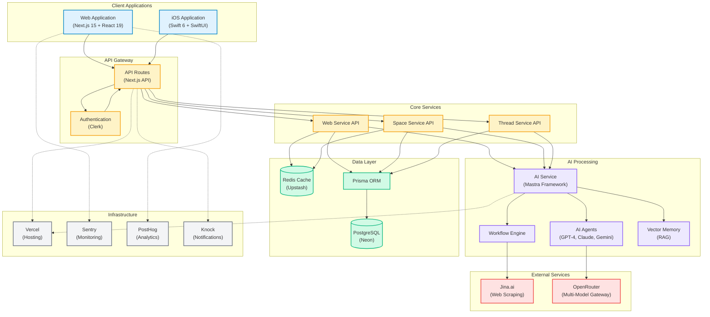

# Webs System Architecture Overview

## Table Of Contents

{/* Generated placeholder; add anchors as needed */}

## Table Of Contents

{/* Generated placeholder; add anchors as needed */}

## Table Of Contents

{/* Generated placeholder; add anchors as needed */}

Generated via `/user:diagram` command on [2025-07-03]

## Overview

This diagram illustrates the complete system architecture of the Webs platform, showing how the web application (xyz), AI service (ai), and iOS app (apple) integrate to create an AI-native web research platform.

## Architecture Diagram

## Key Components

### Client Layer
- **Web Application**: Next.js 15 with React 19, server components, and real-time updates
- **iOS Application**: Native Swift 6 app with SwiftUI and SwiftData

### API Layer
- **API Gateway**: Next.js API routes with authentication middleware
- **Authentication**: Clerk integration for user management

### Service Layer
- **Web Service**: Manages web submissions and analysis
- **Space Service**: Handles workspace organization
- **Thread Service**: Manages conversation threads

### AI Processing
- **Mastra Framework**: Orchestrates AI workflows and agents
- **AI Agents**: Multiple model support (GPT-4, Claude, Gemini)
- **Workflow Engine**: Parallel processing of analysis tasks
- **Vector Memory**: RAG implementation for context

### Data Layer
- **PostgreSQL**: Primary database via Neon
- **Redis**: Caching and rate limiting via Upstash
- **Prisma**: Type-safe ORM

### External Services
- **Jina.ai**: Web content extraction and parsing
- **OpenRouter**: Unified API for multiple AI models

### Infrastructure
- **Vercel**: Hosting and edge functions
- **Sentry**: Error tracking and monitoring
- **PostHog**: Product analytics
- **Knock**: Notification service

## Data Flow

1. User submits URL via Web/iOS app
2. Request authenticated via Clerk
3. API creates Web record in PostgreSQL
4. AI Service triggered for analysis
5. Jina.ai fetches and parses content
6. AI agents analyze in parallel
7. Results combined and stored
8. Client updated via SWR/polling

## Related Diagrams

- [Web Analysis Workflow](../data-flow/webs-analysis-workflow.md)
- [Authentication Flow](../data-flow/auth-flow.md)
- [AI Processing Pipeline](../component/ai-pipeline.md)

---

*Last Updated: 2025-07-03*
*Generated with `/user:diagram` command*
---
title: Webs System Architecture Overview
description: High-level architecture diagram and integration overview for Webs
---

## See Also

- [Overview](/architecture/overview)
- [Turborepo](/architecture/turborepo)
- [AI Sdk](/tools/stack/ai-sdk)
