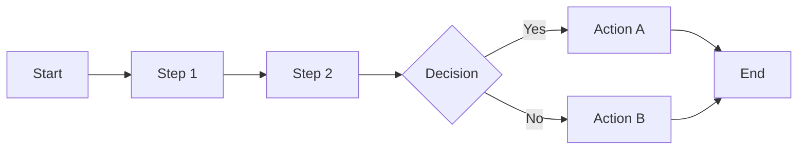
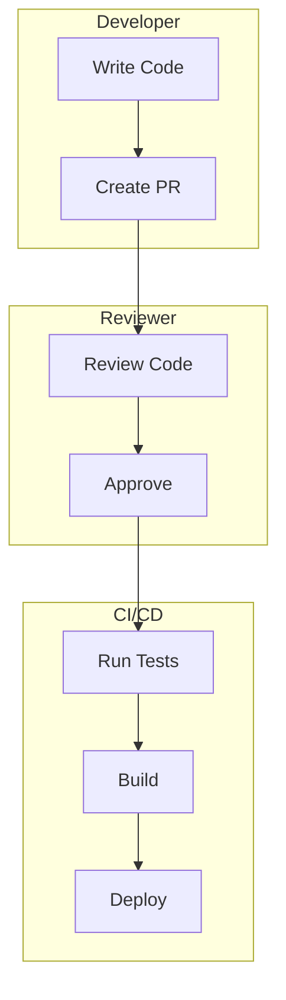
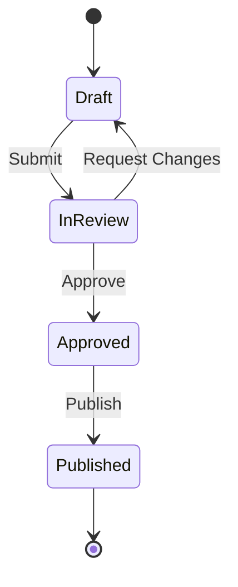

# Workflow Diagrams

Process flows, user journeys, and operational procedures visualized for clarity and understanding.

## Categories

### development/
Software development workflows:
- Feature development flow
- CI/CD pipelines
- Code review process
- Release procedures
- Testing workflows

### operations/
Operational and business workflows:
- Deployment procedures
- Incident response
- Monitoring workflows
- Backup procedures
- User onboarding

## Common Workflow Types

### 1. Sequential Process Flow


### 2. Swimlane Diagram


### 3. State Machine


## Creating Workflow Diagrams

```bash
# Development Workflow
/user:diagram development workflow for feature releases

# User Journey
/user:diagram user journey for onboarding process

# Operational Procedure
/user:diagram deployment procedure for production
```

## Best Practices

1. **Clear Start/End**: Mark beginning and end points
2. **Decision Points**: Clearly show branches
3. **Actor Identification**: Show who performs each step
4. **Time Indicators**: Add duration where relevant
5. **Error Paths**: Include failure scenarios

## See Also

- [Overview](/architecture/overview)
- [Turborepo](/architecture/turborepo)
- [AI Sdk](/tools/stack/ai-sdk)
