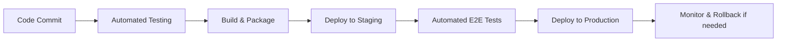
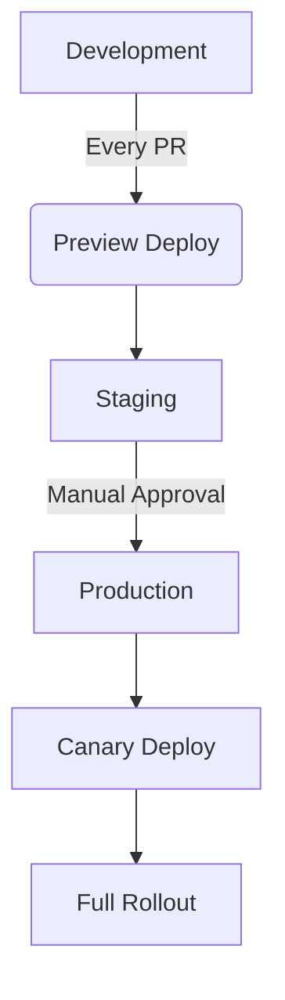

# CI/CD

## Table Of Contents

<!-- Generated placeholder; add anchors as needed -->

## Table Of Contents

<!-- Generated placeholder; add anchors as needed -->

## Overview

Continuous Integration and Continuous Deployment (CI/CD) automates the software delivery process, enabling teams to ship code faster and more reliably. This guide covers CI/CD patterns for Next.js applications using GitHub Actions, Turborepo, and deployment platforms.

## CI/CD Philosophy



## Toolchain

- **GitHub Actions**: Workflow automation
- **Turborepo**: Build orchestration
- **Vercel**: Next.js deployment platform
- **Docker**: Containerization for edge cases
- **Dependabot**: Dependency updates
- **CodeQL**: Security scanning

## Repository Structure

```
.github/
├── workflows/
│   ├── ci.yml                    # Main CI workflow
│   ├── deploy.yml               # Production deploy
│   ├── release.yml              # Release automation
│   └── dependency-review.yml    # Security review
├── CODEOWNERS                   # Code review requirements
└── dependabot.yml               # Dependency updates
```

## Main Ci Workflow

### `.github/workflows/ci.yml`

```yaml
name: CI

on:
  push:
    branches: [main, develop]
  pull_request:
    branches: [main]
  workflow_dispatch: # Allow manual trigger

env:
  NODE_VERSION: '20'
  PNPM_VERSION: '8'

jobs:
  lint:
    name: Lint
    runs-on: ubuntu-latest
    steps:
      - name: Checkout
        uses: actions/checkout@v4
        
      - name: Setup pnpm
        uses: pnpm/action-setup@v2
        with:
          version: ${{ env.PNPM_VERSION }}
          
      - name: Setup Node.js
        uses: actions/setup-node@v4
        with:
          node-version: ${{ env.NODE_VERSION }}
          cache: 'pnpm'
          
      - name: Install dependencies
        run: pnpm install --frozen-lockfile
        
      - name: Run linter
        run: pnpm lint

  typecheck:
    name: Type Check
    runs-on: ubuntu-latest
    steps:
      - name: Checkout
        uses: actions/checkout@v4
        
      - name: Setup pnpm
        uses: pnpm/action-setup@v2
        with:
          version: ${{ env.PNPM_VERSION }}
          
      - name: Setup Node.js
        uses: actions/setup-node@v4
        with:
          node-version: ${{ env.NODE_VERSION }}
          cache: 'pnpm'
          
      - name: Install dependencies
        run: pnpm install --frozen-lockfile
        
      - name: Run type checking
        run: ppm typecheck

  test:
    name: Test
    runs-on: ubuntu-latest
    strategy:
      matrix:
        test-type: [unit, integration, e2e]
        
    steps:
      - name: Checkout
        uses: actions/checkout@v4
        
      - name: Setup pnpm
        uses: pnpm/action-setup@v2
        with:
          version: ${{ env.PNPM_VERSION }}
          
      - name: Setup Node.js
        uses: actions/setup-node@v4
        with:
          node-version: ${{ env.NODE_VERSION }}
          cache: 'pnpm'
          
      - name: Install dependencies
        run: pnpm install --frozen-lockfile
        
      - name: Build packages
        run: pnpm build --filter=!app-*
        
      - name: Run ${{ matrix.test-type }} tests
        run: pnpm test:${{ matrix.test-type }}

  security:
    name: Security Scan
    runs-on: ubuntu-latest
    steps:
      - name: Checkout
        uses: actions/checkout@v4
        
      - name: Run CodeQL
        uses: github/codeql-action/init@v2
        with:
          languages: javascript, typescript
          
      - name: Autobuild
        uses: github/codeql-action/autobuild@v2
        
      - name: Perform CodeQL Analysis
        uses: github/codeql-action/analyze@v2

  build:
    name: Build
    runs-on: ubuntu-latest
    needs: [lint, typecheck, test, security]
    
    steps:
      - name: Checkout
        uses: actions/checkout@v4
        
      - name: Setup pnpm
        uses: pnpm/action-setup@v2
        with:
          version: ${{ env.PNPM_VERSION }}
          
      - name: Setup Node.js
        uses: actions/setup-node@v4
        with:
          node-version: ${{ env.NODE_VERSION }}
          cache: 'pnpm'
          
      - name: Install dependencies
        run: pnpm install --frozen-lockfile
        
      - name: Build all packages and apps
        run: pnpm build
        
      - name: Upload build artifacts
        uses: actions/upload-artifact@v3
        with:
          name: build-artifacts
          path: |
            apps/*/dist
            apps/*/.next
            packages/*/dist
```

## Deployment Workflow

### `.github/workflows/deploy.yml`

```yaml
name: Deploy

on:
  push:
    branches: [main]
  workflow_dispatch:
    inputs:
      environment:
        description: 'Target environment'
        required: true
        default: 'production'
        type: choice
        options:
        - production
        - staging

env:
  VERCEL_ORG_ID: ${{ secrets.VERCEL_ORG_ID }}
  VERCEL_PROJECT_ID: ${{ secrets.VERCEL_PROJECT_ID }}

jobs:
  deploy-preview:
    name: Deploy Preview
    runs-on: ubuntu-latest
    if: github.event_name == 'pull_request'
    
    steps:
      - name: Checkout
        uses: actions/checkout@v4
        
      - name: Setup pnpm
        uses: pnpm/action-setup@v2
        
      - name: Setup Node.js
        uses: actions/setup-node@v4
        with:
          node-version: '20'
          cache: 'pnpm'
          
      - name: Install Vercel CLI
        run: pnpm add -g vercel@latest
        
      - name: Pull Vercel Environment Information
        run: vercel env pull
        
      - name: Build Project
        run: pnpm build
        
      - name: Deploy Preview to Vercel
        run: vercel --prod
        env:
          VERCEL_TOKEN: ${{ secrets.VERCEL_TOKEN }}
          
      - name: Comment PR with deploy URL
        uses: actions/github-script@v6
        with:
          script: |
            const { data: pr } = await github.rest.pulls.get({
              ...context.repo,
              pull_number: context.issue.number
            })
            
            const deploymentUrl = process.env.DEPLOY_URL
            await github.rest.issues.createComment({
              ...context.repo,
              issue_number: context.issue.number,
              body: `🚀 Preview deployment ready: ${deploymentUrl}`
            })

  deploy-production:
    name: Deploy Production
    runs-on: ubuntu-latest
    if: github.ref == 'refs/heads/main' && github.event_name == 'push'
    environment: production
    
    steps:
      - name: Checkout
        uses: actions/checkout@v4
        
      - name: Setup pnpm
        uses: pnpm/action-setup@v2
        
      - name: Setup Node.js
        uses: actions/setup-node@v4
        with:
          node-version: '20'
          cache: 'pnpm'
          
      - name: Install Vercel CLI
        run: pnpm add -g vercel@latest
        
      - name: Pull Vercel Environment Information
        run: vercel env pull
        
      - name: Build Project
        run: pnpm build
        
      - name: Deploy to Vercel
        run: vercel --prod
        env:
          VERCEL_TOKEN: ${{ secrets.VERCEL_TOKEN }}
          
      - name: Run E2E tests on production
        run: pnpm test:e2e:production
        env:
          BASE_URL: https://your-app.vercel.app
```

## Environment Management

### Environment Variables Setup

```yaml
# .github/workflows/env-setup.yml
name: Environment Setup

on: [workflow_dispatch]

jobs:
  setup-staging:
    name: Setup Staging Environment
    runs-on: ubuntu-latest
    environment: staging
    
    steps:
      - name: Set staging variables
        uses: vercel/actions/env@v1
        with:
          vercel-token: ${{ secrets.VERCEL_TOKEN }}
          vercel-org-id: ${{ secrets.VERCEL_ORG_ID }}
          vercel-project-id: ${{ secrets.VERCEL_PROJECT_ID }}
          envs: |
            NODE_ENV=production
            NEXT_PUBLIC_APP_URL=https://staging.your-app.app
            DATABASE_URL=${{ secrets.STAGING_DATABASE_URL }}
            NEXTAUTH_URL=https://staging.your-app.app
            NEXTAUTH_SECRET=${{ secrets.STAGING_NEXTAUTH_SECRET }}
```

## Turborepo Integration

### `turbo.json` Configuration

```json
{
  "pipeline": {
    "build": {
      "dependsOn": ["^build", "^test"],
      "outputs": ["dist/**", ".next/**", "!.next/cache/**"]
    },
    "test": {
      "dependsOn": ["build"],
      "outputs": []
    },
    "lint": {
      "outputs": []
    },
    "typecheck": {
      "outputs": []
    },
    "deploy": {
      "dependsOn": ["build", "test", "lint"],
      "outputs": []
    }
  }
}
```

## Docker Support

### Multi-stage Dockerfile

```dockerfile
# Dockerfile
FROM node:20-alpine AS base
WORKDIR /app
COPY pnpm-lock.yaml pnpm.yaml
COPY .npmrc .npmrc

FROM base AS deps
RUN --mount=type=cache,id=pnpm,target=/root/.local/share/pnpm \
    pnpm install --frozen-lockfile

FROM base AS builder
ENV NODE_ENV=production
COPY --from=deps /app/node_modules ./node_modules
COPY . .
RUN --mount=type=cache,id=pnpm,target=/root/.local/share/pnpm \
    pnpm build

FROM base AS runner
ENV NODE_ENV=production
COPY --from=builder /app/next.config.mjs ./
COPY --from=builder /app/public ./public
COPY --from=builder /app/.next/standalone ./
COPY --from=builder /app/.next/static ./.next/static

EXPOSE 3000

ENV PORT 3000
ENV HOSTNAME "0.0.0.0"

CMD ["node", "server.js"]
```

### Docker Deployment Workflow

```yaml
# .github/workflows/deploy-docker.yml
name: Deploy Docker

on:
  push:
    tags: ['v*']

jobs:
  build-and-push:
    name: Build and Push Docker Image
    runs-on: ubuntu-latest
    
    steps:
      - name: Checkout
        uses: actions/checkout@v4
        
      - name: Set up Docker Buildx
        uses: docker/setup-buildx-action@v3
        
      - name: Login to Container Registry
        uses: docker/login-action@v3
        with:
          registry: ghcr.io
          username: ${{ github.actor }}
          password: ${{ secrets.GITHUB_TOKEN }}
          
      - name: Extract metadata
        id: meta
        uses: docker/metadata-action@v5
        with:
          images: ghcr.io/${{ github.repository }}
          tags: |
            type=ref,event=branch
            type=ref,event=pr
            type=semver,pattern={{version}}
            type=semver,pattern={{major}}.{{minor}}
            type=raw,value=latest,enable={{is_default_branch}}
            
      - name: Build and push Docker image
        uses: docker/build-push-action@v5
        with:
          context: .
          platforms: linux/amd64,linux/arm64
          push: true
          tags: ${{ steps.meta.outputs.tags }}
          labels: ${{ steps.meta.outputs.labels }}
          cache-from: type=gha
          cache-to: type=gha,mode=max
```

## Monitoring And Alerts

### Health Check Workflow

```yaml
# .github/workflows/health-check.yml
name: Health Check

on:
  schedule:
    - cron: '0 */6 * * *'  # Every 6 hours
  workflow_dispatch:

jobs:
  check-prod:
    name: Check Production Health
    runs-on: ubuntu-latest
    
    steps:
      - name: Health check
        run: |
          response=$(curl -s -o /dev/null -w "%{http_code}" https://your-app.vercel.app/api/health)
          if [ $response -ne 200 ]; then
            echo "Health check failed with status $response"
            exit 1
          fi
          
      - name: Notify on failure
        if: failure()
        uses: 8398a7/action-slack@v3
        with:
          status: failure
          fields: repo,message,commit,author,action,eventName,ref,workflow
          text: 'Production health check failed!'
        env:
          SLACK_WEBHOOK_URL: ${{ secrets.SLACK_WEBHOOK_URL }}
```

## Best Practices

### 1. Pipeline Optimization

```yaml
# Use Matrix For Parallel Testing
strategy:
  matrix:
    os: [ubuntu-latest, windows-latest]
    node-version: [18, 20]
    
# Cache Dependencies For Faster Builds
- name: Cache pnpm modules
  uses: actions/cache@v3
  with:
    path: ~/.pnpm-store
    key: ${{ runner.os }}-pnpm-${{ hashFiles('**/pnpm-lock.yaml') }}
```

### 2. Security Considerations

- Always use secrets for sensitive data
- Limit permissions with least privilege原则
- Scan dependencies for vulnerabilities
- Use pinned versions for actions

### 3. Environment Strategy



## Troubleshooting

### Common Issues

1. **Build Failures**
   ```bash
   # Check build logs
   gh run view --log
   
   # Re-run failed jobs
   gh run rerun <run-id>
   ```

2. **Permission Issues**
   - Ensure all required secrets are set
   - Check GH_TOKEN permissions
   - Verify CODEOWNERS file syntax

3. **Deployment Rollbacks**
   ```bash
   # Rollback using Vercel CLI
   vercel rollback --prod
   
   # Or using GitHub CLI
   gh run view # Find last successful deploy
   ```

## Advanced Patterns

### Monorepo Deployment

```yaml
# Deploy Specific Apps In Turborepo
jobs:
  deploy-apps:
    name: Deploy Apps
    runs-on: ubuntu-latest
    strategy:
      matrix:
        app: [web, admin, api]
        
    steps:
      - name: Build and deploy ${{ matrix.app }}
        run: |
          pnpm --filter ${{ matrix.app }} deploy
```

### Feature Flags

```yaml
# Deploy Features Behind Flags
- name: Deploy with feature flags
  run: |
    pnpm deploy -- --feature-flag=new-ui \
                 --feature-flag=beta-api \
                 --target=production
```

## Resources

- [GitHub Actions Documentation](https://docs.github.com/en/actions)
- [Vercel CI/CD Guide](https://vercel.com/docs/ci-cd)
- [Turborepo CI Guide](https://turbo.build/repo/docs/cicd)

## See Also

- [Turborepo (Architecture)](/architecture/turborepo)
- [Turborepo (Stack Guide)](/tools/stack/turborepo)
- [Testing](/stack/testing/testing)
- [Docker Best Practices](https://docs.docker.com/develop/dev-best-practices/)