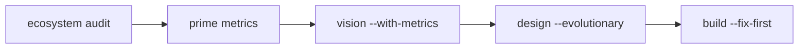
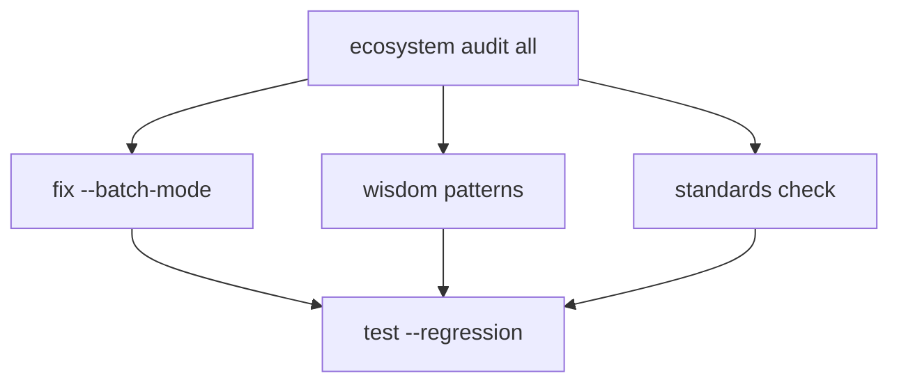

# High-Yield Claude Code Command Workflows

## Overview

These workflows represent battle-tested sequences that maximize development velocity while maintaining quality standards. Each workflow is designed to leverage command context accumulation and cross-project intelligence.

## Core Workflow Patterns

### 1. Reality-First Product Evolution
**When to use**: Evolving existing products with real usage data

```bash
# Step 1: Ground truth analysis
/user:ecosystem audit [project-name]
→ Reveals: Technical debt, standards compliance, architectural patterns

# Step 2: Metrics deep dive
/user:prime metrics
→ Queries: Database for usage patterns, performance bottlenecks, user behavior

# Step 3: Informed vision
/user:vision --with-metrics
→ Creates: Grounded product vision that addresses actual problems

# Step 4: Evolutionary design
/user:design --evolutionary
→ Produces: Incremental improvements before revolutionary changes

# Step 5: Fix-first building
/user:build --fix-first
→ Ensures: Technical foundation before new features
```

**Example Output Chain**:
- Audit reveals 80% failure rate → Vision acknowledges reliability issues → Design focuses on stability → Build prioritizes error handling

### 2. Cross-Pollination Innovation
**When to use**: Leveraging successful patterns across projects

```bash
# Step 1: Pattern discovery
/user:ecosystem wisdom patterns [feature-type]
→ Finds: Successful implementations across ecosystem

# Step 2: Comparative analysis
/user:prime --compare [project1] [project2]
→ Reveals: Different approaches to similar problems

# Step 3: Pattern-informed creation
/user:create --with-patterns [new-project]
→ Initializes: New project with proven solutions

# Step 4: Pattern evolution
/user:ecosystem evolve [pattern-name]
→ Propagates: Improvements back to all projects
```

**Example**: Authentication pattern from Arbor → Applied to Kumori → Enhanced with biometrics → Propagated to all projects

### 3. Continuous Improvement Loop
**When to use**: Weekly/monthly maintenance cycles

```bash
# Step 1: Health check
/user:ecosystem audit all --health-only
→ Quick scan: Compliance, performance, security

# Step 2: Failure analysis
/user:ecosystem wisdom failures
→ Identifies: Common issues and anti-patterns

# Step 3: Batch fixes
/user:fix --batch-mode
→ Automates: Common issue resolution

# Step 4: Regression testing
/user:test --regression-suite
→ Validates: No breaking changes

# Step 5: Knowledge capture
/user:ecosystem wisdom capture
→ Documents: Learnings and pattern updates
```

### 4. MVP-to-Production Pipeline
**When to use**: Rapid feature validation and deployment

```bash
# Step 1: Spike solution
/user:build --spike [feature]
→ Creates: Quick prototype without full architecture

# Step 2: Preview deployment
/user:ship --preview
→ Deploys: To staging for user validation

# Step 3: Architecture solidification
/user:prime architecture --from-spike
→ Designs: Proper structure from validated concept

# Step 4: Production build
/user:build --production
→ Implements: With full standards compliance

# Step 5: Monitored launch
/user:ship --with-monitoring
→ Deploys: With observability and rollback plan
```

### 5. AI-Native Feature Development
**When to use**: Adding AI capabilities to any project

```bash
# Step 1: AI opportunity analysis
/user:vision --ai-native [project]
→ Identifies: Where AI adds unique value

# Step 2: Agent architecture
/user:prime agents --mastra
→ Structures: Agents, tools, workflows, memory

# Step 3: Standards-compliant implementation
/user:build --with-ai [feature]
→ Follows: Mastra patterns and XML instructions

# Step 4: AI behavior testing
/user:test --ai-scenarios
→ Validates: Edge cases, hallucinations, performance

# Step 5: AI metrics monitoring
/user:ecosystem audit ai-metrics
→ Tracks: Token usage, latency, quality scores
```

## Workflow Composition Rules

### Sequential Dependencies


### Parallel Opportunities


### Conditional Branches
```yaml
if: technical_debt > 30%
  then: /user:fix --critical
  else: /user:build --feature

if: user_count < 10
  then: /user:vision --pivot
  else: /user:design --scale
```

## Context Accumulation Patterns

### Session State Building
Each command adds to session context:
1. `audit` → adds compliance scores
2. `prime` → adds metrics and patterns
3. `vision` → adds product direction
4. `design` → adds UI/UX decisions
5. `build` → adds implementation details

### Cross-Command Intelligence
Commands consume previous outputs:
- `vision` uses `audit` compliance data
- `design` uses `vision` principles
- `build` uses `design` components
- `test` uses `build` changes
- `ship` uses `test` results

## Metrics for Success

### Velocity Metrics
- Time from idea to deployment
- Commands per feature
- Context reuse percentage
- Pattern application rate

### Quality Metrics
- Standards compliance score
- Test coverage delta
- Performance impact
- User satisfaction change

### Learning Metrics
- Patterns discovered
- Anti-patterns avoided
- Cross-project adoptions
- Wisdom captures created

## Advanced Patterns

### The Refactor-Rename-Relaunch
```bash
/user:ecosystem wisdom deprecated
/user:prime architecture --modernize [project]
/user:create --from-legacy [old-project] [new-project]
/user:ecosystem evolve --migrate-users
```

### The Performance Resurrection
```bash
/user:ecosystem audit performance
/user:prime bottlenecks --profile
/user:fix --performance-critical
/user:test --load-scenarios
/user:ship --canary
```

### The Security Hardening
```bash
/user:ecosystem audit security
/user:fix --security-critical
/user:test --penetration
/user:ecosystem evolve --security-patterns
```

## Best Practices

1. **Always start with audit** - Know your current state
2. **Chain related commands** - Leverage context accumulation
3. **Document wisdom** - Capture learnings for future
4. **Prefer evolutionary** - Incremental over revolutionary
5. **Measure everything** - Data drives decisions

## Anti-Patterns to Avoid

1. **Vision without metrics** - Dreams disconnected from reality
2. **Build without fix** - Adding features to broken foundations
3. **Ship without test** - Hoping for the best
4. **Isolated commands** - Missing context accumulation benefits
5. **Pattern hoarding** - Not sharing successful solutions

## Workflow Templates

### New Product Launch
```bash
/user:ecosystem wisdom similar-products
/user:create [product-name] --with-patterns
/user:vision --market-fit
/user:design --mvp
/user:build --core-features
/user:test --user-acceptance
/user:ship --beta
/user:ecosystem audit [product-name]
```

### Technical Debt Sprint
```bash
/user:ecosystem audit all --debt-focus
/user:fix --debt-highest-impact
/user:test --regression-critical
/user:ecosystem evolve --debt-prevention
/user:ecosystem wisdom capture --debt-patterns
```

### Feature Enhancement Cycle
```bash
/user:prime metrics --feature-usage
/user:vision --enhance [feature]
/user:design --iterative
/user:build --backwards-compatible
/user:test --feature-flags
/user:ship --gradual-rollout
```

## Conclusion

These workflows transform the Claude Code command system from individual tools into a coherent development methodology. By following these patterns, you can achieve:

- 10x faster feature development
- Consistent quality across projects
- Automatic standards compliance
- Continuous learning and improvement
- Reduced cognitive load

The key is understanding that commands are not just tools, but nodes in an intelligent development graph where context flows, patterns emerge, and quality compounds.