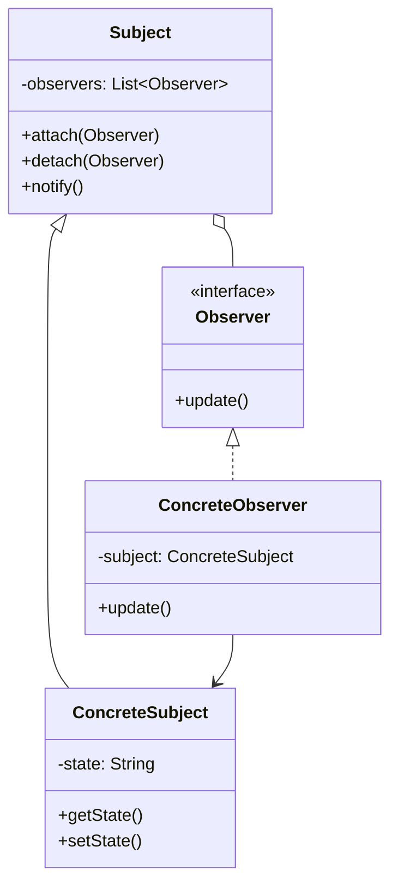
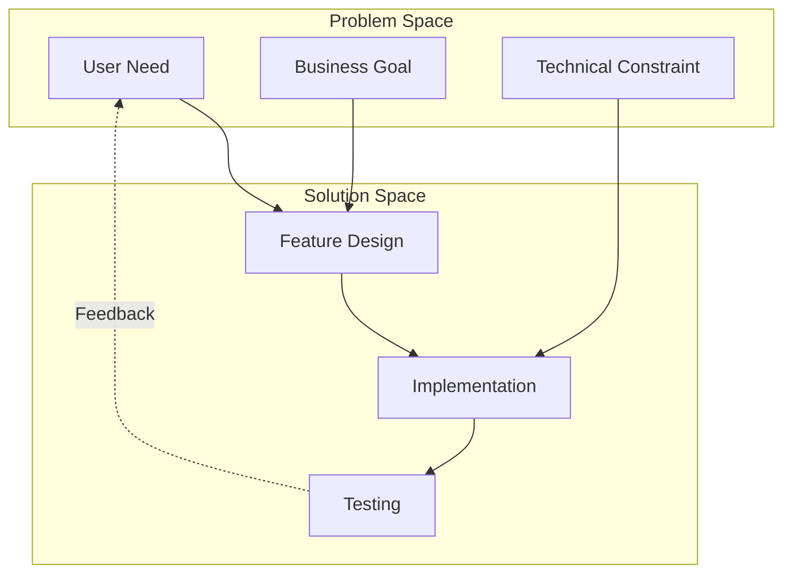

# Conceptual Diagrams

Abstract concepts, mental models, and design patterns visualized for better understanding.

## Categories

### patterns/
Design and architectural patterns:
- Software design patterns (Factory, Observer, etc.)
- Architecture patterns (MVC, MVVM, etc.)
- Integration patterns
- Anti-patterns to avoid

### mental-models/
Abstract concepts and frameworks:
- System thinking models
- Problem-solving frameworks
- Decision matrices
- Conceptual relationships

## Example: Design Pattern



## Example: Mental Model



## Creating Conceptual Diagrams

```bash
# Design pattern
/user:diagram observer pattern implementation

# Mental model
/user:diagram conceptual model for ai-driven development

# System thinking
/user:diagram feedback loops in user engagement
```

## Best Practices

1. **Abstraction Level**: Keep appropriate abstraction
2. **Clear Relationships**: Show how concepts connect
3. **Consistent Notation**: Use standard notations
4. **Educational Value**: Focus on teaching/explaining
5. **Real-World Connection**: Link to concrete examples